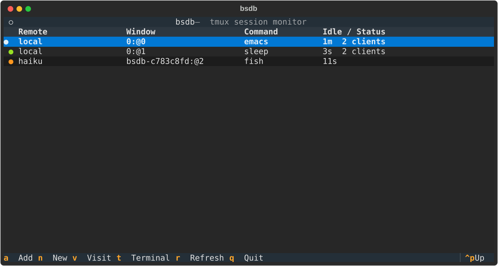

#+title: bsdb - borescope dashboard

bsdb provides ways to launch, monitor and reenter tasks running in local or remote tmux sessions using ssh.

It currently provides some different user interfaces.

- [X] CLI via click
- [X] TUI via textual
- [ ] GUI 
- [ ] WUI

